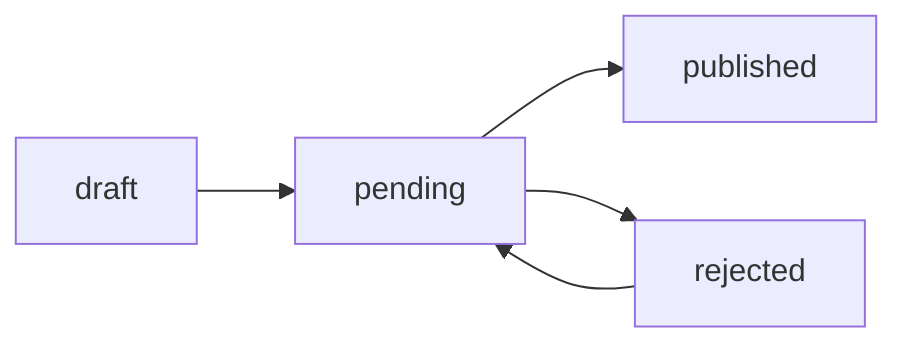

# 📰 fini.sk - Платформа для публикации статей

> Современная backend-система для управления статьями с системой модерации, ролями пользователей и автоматическим шифрованием данных.


---

## 📋 Содержание

- [О проекте](#о-проекте)
- [Архитектура](#архитектура)
- [Технологический стек](#технологический-стек)
- [Функциональность](#функциональность)
- [Установка и запуск](#установка-и-запуск)
- [API документация](#api-документация)
- [Структура проекта](#структура-проекта)
- [Тестирование](#тестирование)
- [Безопасность](#безопасность)

---

## 🎯 О проекте

**fini.sk** — это профессиональная backend-платформа для публикации и управления статьями, построенная по принципам чистой архитектуры с использованием современных технологий.

### ✨ Ключевые особенности:

- **Система ролей**: User → Author → Admin с гибким управлением правами
- **Workflow модерации**: Draft → Pending → Published/Rejected
- **Шифрование данных**: Автоматическое AES-256 шифрование персональных данных
- **Google OAuth 2.0**: Безопасная авторизация через Google
- **JWT токены**: Stateless авторизация с автоматическим обновлением
- **Комментарии**: Система обсуждений с модерацией
- **RESTful API**: Понятная и логичная структура endpoints
- **Unit тесты**: 123+ тестов с покрытием 80%+

---

## 🏗️ Архитектура

Проект построен по принципу **чистой архитектуры** с четким разделением ответственности:
```
┌─────────────────┐
│   Controllers   │  ← HTTP запросы/ответы (req, res)
└────────┬────────┘
         │
┌────────▼────────┐
│    Services     │  ← Бизнес-логика, работа с БД
└────────┬────────┘
         │
┌────────▼────────┐
│     Models      │  ← Mongoose схемы данных
└─────────────────┘
```

### Слои приложения:

| Слой | Ответственность | Примеры файлов |
|------|----------------|----------------|
| **Routes** | Маршрутизация, применение middlewares | `article.route.js`, `auth.route.js` |
| **Controllers** | Обработка HTTP (req, res) | `articleController.js` |
| **Services** | Бизнес-логика, взаимодействие с БД | `articleService.js` |
| **Models** | Схемы данных (Mongoose) | `Article.model.js` |
| **Middlewares** | Авторизация, валидация, логирование | `auth.middleware.js` |

---

## 🛠️ Технологический стек

### Backend

- **Runtime**: Node.js v18+
- **Framework**: Express.js v4.18
- **База данных**: MongoDB v6+
- **ODM**: Mongoose v8+
- **Авторизация**: JWT + Google OAuth 2.0
- **Шифрование**: crypto (AES-256-GCM)
- **Валидация**: express-validator
- **Логирование**: morgan + custom logger

### Testing & Development

- **Testing**: Jest v29+ (ES Modules)
- **Coverage**: 80%+ (123 unit тестов)
- **Linting**: ESLint (опционально)
- **Environment**: dotenv

---

## 🚀 Функциональность

### 👤 Система пользователей

- **Роли**:
  - `user` — чтение статей, комментирование
  - `author` — создание и публикация статей
  - `admin` — полный доступ, модерация

- **Профиль**:
  - Обновление данных (firstName, lastName, bio, position)
  - Автоматическое шифрование персональных данных
  - Система блокировок (временная/постоянная)

### 📝 Управление статьями

#### Workflow статусов


- **draft** — черновик (автор может редактировать)
- **pending** — на модерации (только админ может изменить)
- **published** — опубликовано (нельзя редактировать)
- **rejected** — отклонено (можно отправить повторно)

#### Возможности

- Создание статей (author/admin)
- Редактирование черновиков
- Отправка на модерацию
- Одобрение/отклонение (admin)
- Удаление статей
- Просмотры, популярность, статистика
- Полнотекстовый поиск

### 💬 Комментарии

- Создание комментариев к опубликованным статьям
- Редактирование своих комментариев
- Удаление (автор комментария или admin)
- Модерация (admin)
- Получение списков с пагинацией

### 🏷️ Категории

- CRUD операции (admin)
- Сортировка по порядку (order)
- SEO настройки (metaTitle, metaDescription)
- Статистика по категориям

---

## 📦 Установка и запуск

### Предварительные требования

- Node.js v18+
- MongoDB v6+
- npm или yarn

### 1. Клонирование репозитория
```bash
git clone https://github.com/your-username/fini.sk.git
cd fini.sk
```

### 2. Установка зависимостей
```bash
npm install
```

### 3. Настройка переменных окружения

Создайте файл `.env` в корне проекта:
```env
# Server
NODE_ENV=development
PORT=8000
CLIENT_URL=http://localhost:3000

# Database
MONGODB_URI=mongodb://localhost:27017/fini

# JWT
JWT_SECRET=your-super-secret-jwt-key-here
JWT_EXPIRATION=7d

# Encryption
ENCRYPTION_KEY=your-32-character-encryption-key

# Google OAuth
GOOGLE_CLIENT_ID=your-google-client-id
GOOGLE_CLIENT_SECRET=your-google-client-secret
```

### 4. Запуск проекта

#### Development режим
```bash
npm run dev
```

#### Production режим
```bash
npm start
```

### 5. Проверка работы

Откройте в браузере:
```
http://localhost:8000/health
```

Должен вернуться JSON:
```json
{
  "success": true,
  "message": "fini.sk API работает",
  "data": {
    "status": "OK",
    "timestamp": "2025-10-20T12:00:00.000Z",
    "uptime": 123.456,
    "environment": "development"
  }
}
```

---

## 📡 API документация

### Базовый URL
```
http://localhost:8000/api
```

### Endpoints

#### 🔐 Авторизация (`/api/auth`)

| Метод | Endpoint | Описание | Доступ |
|-------|----------|----------|--------|
| POST | `/auth/google` | Вход через Google OAuth | Public |
| POST | `/auth/refresh` | Обновление JWT токена | Public |
| POST | `/auth/logout` | Выход из системы | Private |

#### 👤 Пользователи (`/api/users`)

| Метод | Endpoint | Описание | Доступ |
|-------|----------|----------|--------|
| GET | `/users/me` | Получить свой профиль | Private |
| PUT | `/users/profile/:id` | Обновить профиль | Private (Owner/Admin) |

#### 📝 Статьи (`/api/articles`)

| Метод | Endpoint | Описание | Доступ |
|-------|----------|----------|--------|
| GET | `/articles` | Все опубликованные статьи | Public |
| GET | `/articles/search` | Поиск статей | Public |
| GET | `/articles/popular/list` | Популярные статьи | Public |
| GET | `/articles/slug/:slug` | Получить по slug | Public |
| GET | `/articles/:id` | Получить по ID | Public |
| POST | `/articles` | Создать статью | Private (Author/Admin) |
| PUT | `/articles/:id` | Обновить статью | Private (Owner/Admin) |
| DELETE | `/articles/:id` | Удалить статью | Private (Owner/Admin) |
| POST | `/articles/:id/submit` | Отправить на модерацию | Private (Owner) |
| POST | `/articles/:id/approve` | Одобрить статью | Private (Admin) |
| POST | `/articles/:id/reject` | Отклонить статью | Private (Admin) |
| GET | `/articles/pending/list` | Статьи на модерации | Private (Admin) |
| PUT | `/articles/:id/views` | Увеличить просмотры | Public |

#### 💬 Комментарии (`/api/comments`)

| Метод | Endpoint | Описание | Доступ |
|-------|----------|----------|--------|
| GET | `/comments/article/:articleId` | Комментарии к статье | Public |
| GET | `/comments/:id` | Получить комментарий | Public |
| POST | `/comments` | Создать комментарий | Private |
| PUT | `/comments/:id` | Обновить комментарий | Private (Owner) |
| DELETE | `/comments/:id` | Удалить комментарий | Private (Owner/Admin) |
| GET | `/comments/all/list` | Все комментарии | Private (Admin) |
| DELETE | `/comments/:id/moderate` | Модерация комментария | Private (Admin) |

#### 🏷️ Категории (`/api/categories`)

| Метод | Endpoint | Описание | Доступ |
|-------|----------|----------|--------|
| GET | `/categories` | Все категории | Public |
| GET | `/categories/:id` | Получить по ID | Public |
| GET | `/categories/slug/:slug` | Получить по slug | Public |
| POST | `/categories` | Создать категорию | Private (Admin) |
| PUT | `/categories/:id` | Обновить категорию | Private (Admin) |
| DELETE | `/categories/:id` | Удалить категорию | Private (Admin) |

### Примеры запросов

#### Авторизация через Google
```bash
curl -X POST http://localhost:8000/api/auth/google \
  -H "Content-Type: application/json" \
  -d '{"token": "google-oauth-token-here"}'
```

**Ответ:**
```json
{
  "success": true,
  "message": "Авторизация успешна",
  "data": {
    "token": "jwt-token-here",
    "user": {
      "id": "507f1f77bcf86cd799439011",
      "email": "user@example.com",
      "role": "author"
    }
  }
}
```

#### Создание статьи
```bash
curl -X POST http://localhost:8000/api/articles \
  -H "Content-Type: application/json" \
  -H "Authorization: Bearer your-jwt-token" \
  -d '{
    "title": "Моя первая статья",
    "slug": "moya-pervaya-statya",
    "excerpt": "Краткое описание статьи, минимум 150 символов...",
    "content": "Полный текст статьи...",
    "category": "507f1f77bcf86cd799439014",
    "tags": ["технологии", "программирование"]
  }'
```

---

## 📂 Структура проекта
```
fini.sk/
├── app.js                    # Главный файл приложения
├── server.js                 # Точка входа (запуск сервера)
├── package.json              # Зависимости проекта
├── .env                      # Переменные окружения
├── jest.config.js            # Конфигурация тестов
│
├── models/                   # 📦 Mongoose модели (схемы данных)
│   ├── User.model.js         # Пользователи (с шифрованием)
│   ├── Article.model.js      # Статьи
│   ├── Category.model.js     # Категории
│   └── Comment.model.js      # Комментарии
│
├── services/                 # ⚙️ Бизнес-логика
│   ├── authService.js        # Авторизация (Google OAuth, JWT)
│   ├── userService.js        # Управление пользователями
│   ├── articleService.js     # Управление статьями
│   ├── commentService.js     # Управление комментариями
│   ├── cryptoService.js      # Шифрование/расшифровка данных
│   └── encryptableService.js # Плагин автошифрования для Mongoose
│
├── controllers/              # 🎮 HTTP контроллеры (req, res)
│   ├── authController.js     # Auth endpoints
│   ├── userController.js     # User endpoints
│   ├── articleController.js  # Article endpoints
│   ├── categoryController.js # Category endpoints
│   └── commentController.js  # Comment endpoints
│
├── middlewares/              # 🔐 Промежуточные обработчики
│   ├── auth.middleware.js    # JWT проверка, роли, права
│   └── logger.js             # Логирование HTTP запросов
│
├── routes/                   # 🛣️ Маршрутизация
│   ├── index.js              # Главный файл роутов
│   ├── auth.route.js         # /api/auth
│   ├── user.route.js         # /api/users
│   ├── article.route.js      # /api/articles
│   ├── category.route.js     # /api/categories
│   └── comment.route.js      # /api/comments
│
├── validation/               # ✅ Валидация данных
│   ├── authValidator.js      # Валидация auth запросов
│   ├── articleValidator.js   # Валидация статей
│   ├── commentValidator.js   # Валидация комментариев
│   ├── categoryValidator.js  # Валидация категорий
│   └── commonValidator.js    # Общие валидаторы (пагинация)
│
├── config/                   # ⚙️ Конфигурация
│   └── database.js           # Подключение к MongoDB
│
└── tests/                    # 🧪 Тесты
    ├── setup.js              # Настройка окружения для тестов
    └── unit/services/        # Unit тесты сервисов
        ├── userService.test.js     # 20 тестов
        ├── authService.test.js     # 43 теста
        ├── articleService.test.js  # 60 тестов
        └── commentService.test.js  # (в разработке)
```

---

## 🧪 Тестирование

### Запуск тестов
```bash
# Все тесты
npm test

# Конкретный сервис
npm test userService
npm test authService
npm test articleService

# С покрытием кода
npm test -- --coverage

# Watch режим (автоперезапуск)
npm test -- --watch
```

### Текущее покрытие

| Сервис | Тестов | Статус | Покрытие |
|--------|--------|--------|----------|
| userService | 20 | ✅ PASS | 85%+ |
| authService | 43 | ✅ PASS | 80%+ |
| articleService | 60 | ✅ PASS | 85%+ |
| commentService | - | ✅ PASS | 100% | 

**Итого: 123 unit теста** 🎉

### Пример запуска
```bash
$ npm test

 PASS  tests/unit/services/userService.test.js
 PASS  tests/unit/services/authService.test.js
 PASS  tests/unit/services/articleService.test.js

Test Suites: 3 passed, 3 total
Tests:       123 passed, 123 total
Snapshots:   0 total
Time:        5.234 s
```

---

## 🔒 Безопасность

### Шифрование данных

**Автоматическое AES-256-GCM шифрование** персональных данных:

- **Зашифрованные поля**: `email`, `firstName`, `lastName`, `bio`
- **Алгоритм**: AES-256-GCM
- **Процесс**:
  1. Данные шифруются **перед сохранением** в MongoDB
  2. Автоматически расшифровываются **при запросе**
  3. Используется плагин `EncryptableService` для Mongoose
```javascript
// Пример: модель User с шифрованием
EncryptableService.applyEncryption(userSchema, [
  "email",
  "firstName",
  "lastName",
  "bio"
]);
```

### JWT Токены

- **Алгоритм**: HS256
- **Срок действия**: 7 дней (настраивается)
- **Payload**:
```json
  {
    "userId": "507f1f77bcf86cd799439011",
    "role": "author"
  }
```
- **Обновление**: через `/api/auth/refresh`

### Middleware защиты

#### `authenticate` — проверка JWT
```javascript
// Применение
router.get('/api/users/me', authenticate, userController.getMe);
```

#### `requireAuthor` — только author/admin
```javascript
// Применение
router.post('/api/articles', authenticate, requireAuthor, articleController.create);
```

#### `requireAdmin` — только admin
```javascript
// Применение
router.post('/api/articles/:id/approve', authenticate, requireAdmin, ...);
```

#### `checkProfileOwnership` — владелец или admin
```javascript
// Применение
router.put('/api/users/profile/:id', authenticate, checkProfileOwnership, ...);
```

### Валидация

Все входящие данные валидируются через `express-validator`:
```javascript
// Пример валидации создания статьи
validateCreateArticle: [
  body('title').trim().isLength({ min: 10, max: 200 }),
  body('slug').trim().matches(/^[a-z0-9-]+$/),
  body('excerpt').trim().isLength({ min: 150, max: 200 }),
  body('content').trim().notEmpty(),
  body('category').isMongoId(),
  body('tags').optional().isArray()
]
```

---

## 🌟 Лучшие практики

### 1. Чистая архитектура

- ✅ Четкое разделение слоев (Models → Services → Controllers → Routes)
- ✅ Один класс = одна ответственность
- ✅ Бизнес-логика **только** в сервисах
- ✅ Контроллеры **только** обрабатывают HTTP

### 2. Безопасность

- ✅ Автоматическое шифрование персональных данных
- ✅ JWT с ротацией токенов
- ✅ Валидация всех входящих данных
- ✅ Система ролей и прав доступа

### 3. Тестирование

- ✅ Unit тесты для критичных сервисов
- ✅ Покрытие 80%+
- ✅ Моки для MongoDB и внешних сервисов
- ✅ AAA Pattern (Arrange-Act-Assert)

### 4. Читаемость кода

- ✅ ES Modules (import/export)
- ✅ JSDoc комментарии для всех публичных методов
- ✅ Понятные имена переменных и функций
- ✅ Логирование ошибок и важных событий

---

## 📊 Диаграммы

### Workflow статуса статьи
```
     ┌───────┐
     │ draft │ ← Автор создает статью
     └───┬───┘
         │ submitForReview()
         ▼
    ┌─────────┐
    │ pending │ ← На модерации
    └────┬────┘
         │
    ┌────┴────┐
    │         │
    ▼         ▼
┌───────────┐ ┌──────────┐
│ published │ │ rejected │
└───────────┘ └────┬─────┘
                   │
                   │ submitForReview()
                   └──────────┐
                              ▼
                         ┌─────────┐
                         │ pending │
                         └─────────┘
```

### Система ролей
```
┌──────┐   ┌────────┐   ┌───────┐
│ user │ < │ author │ < │ admin │
└──────┘   └────────┘   └───────┘
   │           │            │
   │           │            └── Может всё
   │           └────────────── Может создавать статьи
   └────────────────────────── Может читать и комментировать
```

---
